<!-- ============================================================= -->
<!-- 1구역 : 프로젝트 소개                                          -->
<!-- ============================================================= -->

<div align="center">


<!-- ↑ 나중에 디자인한 배너 PNG(image/banner.png)로 교체해도 됩니다 -->

### 🍼 AI가 함께하는 올인원 육아 케어 플랫폼

일기 · 건강 · 가계부 · 리콜 · 안전 관리를 하나의 플랫폼에 통합하고<br/>
평소처럼 **기록**만 하면, **AI가 분석**하고, 필요한 순간에 **먼저 알려줍니다.**

<br/>

[](https://app.notion.com/p/Team_-3ad67e72aa2780e6af67e5b07c15b06e)
&nbsp;
[](https://youtu.be/pjrz7tYPWqI)
&nbsp;
[](image/아이봄_풀스택.pdf)
&nbsp;
[](image/아이봄_AI.pdf)

<br/>

**주요 기술 스택**


<br/>

<sub><b>기적의 세대</b> &nbsp;|&nbsp; 2026.08.03 ~ 2026.08.30 &nbsp;|&nbsp; <a href="https://github.com/sai0734/Team_The-Worst-Generation">sai0734/Team_The-Worst-Generation</a></sub>

</div>

<br/>

<!-- ============================================================= -->
<!-- 2구역 : 목차                                                  -->
<!-- ============================================================= -->

<div align="center">

### 📑 목차

**[프로젝트 소개](#-프로젝트-소개)** ·
**[기술 스택](#-기술-스택)** ·
**[시작하기](#-시작하기)** ·
**[프로젝트 구조](#-프로젝트-구조)**

**[팀원 소개](#-팀원-소개)** ·
**[설계 산출물](#-설계-산출물)** ·
**[성능 최적화](#-성능-최적화)** ·
**[트러블슈팅](#-트러블슈팅)**

**[주요 기능](#-주요-기능)** ·
**[AWS 배포](#-aws-배포)** ·
**[마무리](#-마무리)**

</div>


## 🎯 프로젝트 소개

### 왜 이런 사이트를 만들었나

> **"늘어나는 출생아 수, 부모의 부담은 줄이고 편의성은 늘린다"**
>
> 출생아 수가 반등하며 새롭게 육아를 시작하는 가정이 늘고 있습니다.<br/>
> 그런데 이들을 기다리는 육아 환경은 여전히 흩어져 있습니다.
>
> <sub>출처 — 국가데이터처, 2026년 6월 및 2분기 인구동향</sub>

- **🧩 정보의 파편화** — 일기·건강·가계부·리콜 정보가 기능별로 여러 앱·사이트에 흩어져 한눈에 파악하기 어려움
- **💤 활용되지 못하는 기록** — 각 앱에 기록이 분산 저장된 채 방치되어 데이터 기반 관리·선제적 알림이 불가능
- **🔁 반복되는 수작업** — 리콜 확인, 가계부 입력, 육아일기 작성처럼 매번 손으로 해야 하는 일이 많음
- **🔎 정보 확인의 번거로움** — 아기 피부·대변 상태나 정부지원금 자격처럼 따로 찾아봐야 하는 내용을 매번 보호자가 직접 검색·확인

> 흩어진 육아 서비스를 **하나의 플랫폼에 통합**하고, **기록 → AI 분석 → 케어·알림** 흐름으로 관리 부담을 줄이는 것을 목표로 했습니다.

<table>
<tr>
<td width="50%" align="center">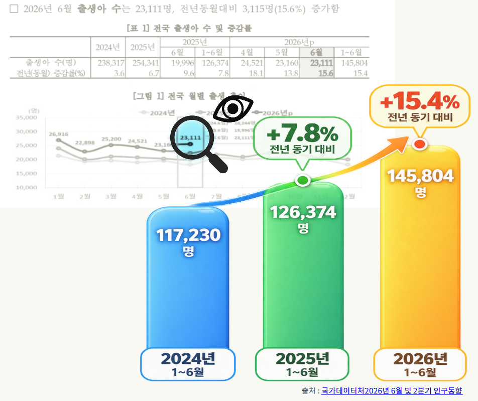<br/><sub>출생아 수 반등</sub></td>
<td width="50%" align="center">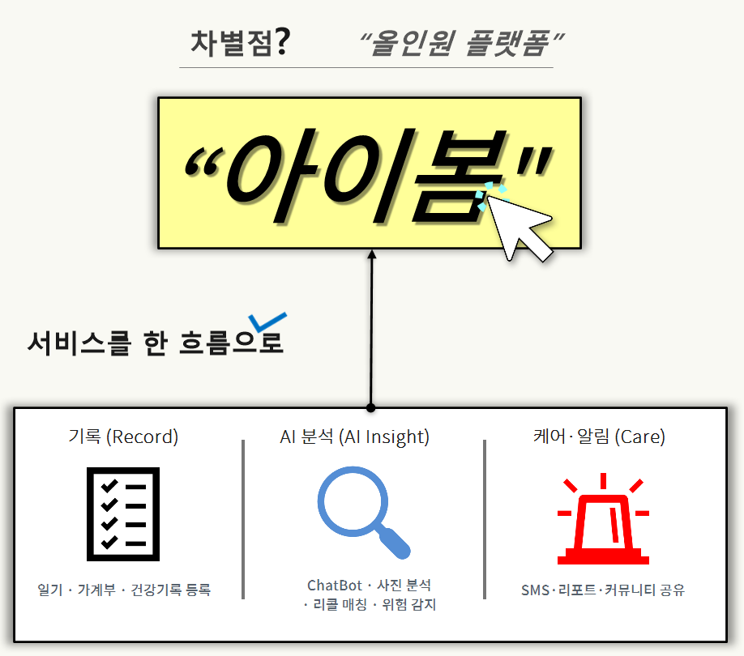<br/><sub>기록 → AI 분석 → 케어·알림</sub></td>
</tr>
</table>

<div align="right"><a href="#-목차"><sub>▲ 목차로</sub></a></div>


<!-- ============================================================= -->
<!-- 기술 스택                                                     -->
<!-- ============================================================= -->

## 🛠 기술 스택

<table>
<tr>
<td align="left" valign="middle"><b>Frontend</b></td>
<td>


</td>
</tr>
<tr>
<td align="left" valign="middle"><b>Backend</b></td>
<td>


</td>
</tr>
<tr>
<td align="left" valign="middle"><b>AI / Data</b></td>
<td>


</td>
</tr>
<tr>
<td align="left" valign="middle"><b>Infra</b></td>
<td>


</td>
</tr>
<tr>
<td align="left" valign="middle"><b>External&nbsp;API</b></td>
<td>


</td>
</tr>
</table>

<div align="center">

#### 📦 그 외 라이브러리 · 외부 서비스

|     | 이름                                   | 용도                         |
| :-: | -------------------------------------- | ---------------------------- |
| 🔌  | `STOMP` / `SockJS`                     | WebSocket 실시간 채팅        |
| ⚡  | `Caffeine`                             | 좌표·알러지 성분 캐싱        |
| 🧬  | `sentence-transformers`                | 리콜 유사도 매칭 임베딩      |
| 🎬  | `moviepy` + `Supertonic` / `Piper` TTS | 육아일기 영상·동화 음성 생성 |
| 🤖  | `OpenClaw`                             | SMS 발송 에이전트            |
| 🛡️  | SafetyKorea Open API                   | 리콜·인증정보 공공 API       |
| 🌦️  | 기상청 단기예보 API                    | 산책 추천 날씨               |

</div>

<div align="right"><a href="#-목차"><sub>▲ 목차로</sub></a></div>


<!-- ============================================================= -->
<!-- 시작하기                                                      -->
<!-- ============================================================= -->

## 🚀 시작하기

<div align="center">


<sub>Docker Desktop 하나만 있으면 6개 서비스가 한 번에</sub>

</div>

### 1) 🐳 Docker Compose (권장)

**① 클론**

```bash
git clone https://github.com/sai0734/Team_The-Worst-Generation.git
cd Team_The-Worst-Generation
```

**② `.env` 준비** — 루트에 `.env` 파일을 만들고 실제 키 값을 채웁니다.

```bash
cp .env.example .env
```

> API 키는 하드코딩하지 않고 루트 `.env` 한 파일로만 관리합니다 (`.gitignore`에 포함, `.env.example`만 커밋). **실제 키 값은 git에 없으니 팀에서 별도로 공유받아 채워야 합니다.** 이 값이 없으면 컨테이너가 뜨지 않거나 해당 기능이 동작하지 않습니다.

<details>
<summary><b>.env 키 목록 펼치기</b></summary>

<br/>

| 키                                                                 | 용도                                    |
| ------------------------------------------------------------------ | --------------------------------------- |
| `JWT_SECRET`                                                       | JWT 로그인 토큰 서명 (없으면 기동 실패) |
| `GOOGLE_VISION_API_KEY`                                            | 알러지·리콜 라벨 OCR                    |
| `SAFETYKOREA_API_KEY`                                              | 리콜·인증정보 공공 API                  |
| `VITE_KAKAO_REST_API_KEY` / `VITE_KAKAO_MAP_API_KEY`               | 카카오 로그인 / 카카오맵                |
| `HOSPITAL_ER_API_KEY` / `HOSPITAL_ER_BASE_URL`                     | 응급실 병상 조회                        |
| `DATA_GO_KR_SERVICE_KEY`                                           | 공공데이터포털 (정부지원금)             |
| `TOSS_SECRET_KEY` / `VITE_TOSS_CLIENT_KEY`                         | 앨범 인화 주문 결제                     |
| `NAVER_CLIENT_ID` / `NAVER_CLIENT_SECRET` / `YOUTUBE_API_KEY`      | AI 행동교정 자료 조회                   |
| `WEATHER_API_SERVICE_KEY`                                          | 기상청 단기예보 (산책 추천)             |
| `OLLAMA_BASE_URL` / `OLLAMA_MODEL`                                 | 온디바이스 LLM                          |
| `AI_SERVER_BASE_URL`                                               | Python FastAPI 서버                     |
| `ANDROID_SMS_BRIDGE_URL` / `ANDROID_SMS_BRIDGE_KEY` / `OPENCLAW_*` | SMS 실발송 브리지                       |
| `STORY_TTS_*`                                                      | 맞춤 동화 TTS (Supertonic / Piper)      |

</details>

**③ 빌드 & 실행**

```bash
docker compose up -d --build
```

| 서비스     | 주소                                |
| ---------- | ----------------------------------- |
| 프론트엔드 | http://localhost:3000               |
| 백엔드     | http://localhost:8080               |
| Python AI  | http://localhost:5000/health        |
| Ollama     | http://localhost:11434              |
| MariaDB    | localhost:3307 (컨테이너 내부 3306) |

> **첫 기동은 10~30분 걸립니다** — 모델·자산을 처음 내려받기 때문이며 온라인 연결이 필요합니다.
>
> - Ollama 모델 4개 → `ollama-init` 서비스가 자동 다운로드
> - ai-server 자산(수면 이상탐지 모델 · 정부지원금 벡터DB 색인 · 동화 TTS) → 자동 준비, 수동 명령 불필요
> - 진행 상황 확인 → `docker compose logs -f ai-server` 의 `[init]` 로그
> - 자세한 절차 → [`docker/DOCKER_SETTING_README.md`](docker/DOCKER_SETTING_README.md)
>
> ⚠️ 리콜 SMS 자동 알림은 도커에서 동작하지 않습니다 (네이티브 전용).

### 2) 개별 실행

> **MariaDB**(`:3306`, DB `BABYDB`)를 먼저 띄워 둡니다.
> 아래 **0~4번은 각각 별도 터미널**에서, 모두 **프로젝트 루트**에서 시작합니다. (환경: Windows PowerShell)

```powershell
# 0) Ollama 모델 준비 (최초 1회)
#    qwen3:8b · parenting-qwen:8b · llava · qwen2.5vl:7b
ai\ollama\setup-ollama.cmd

# 1) 백엔드  ->  http://localhost:8080
cd baby_back
.\gradlew.bat bootRun

# 2) 프론트엔드  ->  http://localhost:3000
cd baby_front
npm install
npm run dev

# 3) Python AI 서버  ->  http://localhost:5000
cd ai\ai-server
python -m venv .venv
.\.venv\Scripts\Activate.ps1
pip install -r requirements.txt
uvicorn main:app --reload --host 127.0.0.1 --port 5000

# 4) OpenClaw 게이트웨이  ->  :18789  (리콜 SMS 발송용)
ai\openclaw\setup-openclaw.cmd launch
```

<div align="right"><a href="#-목차"><sub>▲ 목차로</sub></a></div>


<!-- ============================================================= -->
<!-- 프로젝트 구조                                                  -->
<!-- ============================================================= -->

## 📁 프로젝트 구조

```
Team_The-Worst-Generation/
├── baby_front/                      # React 18 + Vite + TypeScript
│   └── src/
│       ├── api/                     # Axios API 모듈
│       ├── components/              # 도메인별 컴포넌트
│       ├── pages/ · router/         # 페이지 · 라우트(코드 스플리팅)
│       ├── slices/ · hooks/         # Redux Toolkit · Custom Hooks
│       └── layouts/ · styles/
├── baby_back/                       # Spring Boot 3.5 + MyBatis
│   └── src/main/java/com/backend/   # 도메인별 패키지 26개 (+ global)
│       ├── auth · babyInfo · diary · album · ledger · recall
│       ├── babysitter · community · market · quest · assistant
│       ├── health · allergy · homecam · crycheck · hospital · story …
│       └── global/                  # 공통 config · security · advice
├── ai/
│   ├── ai-server/                   # FastAPI — 수면·홈캠·동화·리콜·지원금
│   ├── ollama/                      # Modelfile (parenting-qwen:8b)
│   └── openclaw/                    # SMS 발송 에이전트 + Android 브리지
├── docker/
└── docker-compose.yml              # MariaDB · Backend · Frontend · Python AI · Ollama · OpenClaw
```

<div align="right"><a href="#-목차"><sub>▲ 목차로</sub></a></div>


<!-- ============================================================= -->
<!-- 팀원 소개                                                     -->
<!-- ============================================================= -->

## 👥 팀원 소개

<table>
<tr><th width="90">사진</th><th width="90">팀원</th><th>담당</th></tr>
<tr>
<td align="center"><a href="https://github.com/GITHUB_ID"></a></td>
<td align="center"><a href="https://github.com/GITHUB_ID"><b>황용현</b></a><br/><sub>팀장</sub></td>
<td><ul>
<li>아이 등록·대시보드 — 성장·접종·수면 기록 Recharts 시각화</li>
<li>육아일기·앨범 — 무한 스크롤·페이징, exifr, 드래그 앤 드롭, Toss 결제, AI 일기 자동 작성·영상 생성</li>
<li>AI 수면 조언 — scikit-learn 패턴 분석 + qwen3 조언 생성</li>
<li>AI 행동교정 — 뉴스·유튜브 + qwen3 3단계</li>
<li>Custom Hooks — 아이 정보 RTK 전역</li>
</ul></td>
</tr>
<tr>
<td align="center"><a href="https://github.com/GITHUB_ID"></a></td>
<td align="center"><a href="https://github.com/GITHUB_ID"><b>임대한</b></a><br/><sub>팀원</sub></td>
<td><ul>
<li>회원 인증 — JWT (Access/Refresh) · 카카오 소셜 로그인·계정 연동 · 다중 프로필</li>
<li>병원 &amp; SOS — 지도·예약·대기 · 응급실 병상 조회 후 문자 요청</li>
<li>맞춤 동화 — 생성·TTS 재생</li>
<li>정부지원금 어시스턴트 <sub>(공동)</sub> — RAG 구조 · ChromaDB 설정</li>
</ul></td>
</tr>
<tr>
<td align="center"><a href="https://github.com/GITHUB_ID"></a></td>
<td align="center"><a href="https://github.com/GITHUB_ID"><b>이재원</b></a><br/><sub>팀원</sub></td>
<td><ul>
<li>감자마켓 — 중고거래, 거래 검증 체인</li>
<li>홈캠 — 안전구역 이탈 감지 UI</li>
<li>울음소리 분석 — 도메인 프론트 구현</li>
</ul></td>
</tr>
<tr>
<td align="center"><a href="https://github.com/GITHUB_ID"></a></td>
<td align="center"><a href="https://github.com/GITHUB_ID"><b>권용익</b></a><br/><sub>팀원</sub></td>
<td><ul>
<li>가계부 — AI 자동 분류·영수증 OCR·AI 브리핑 (Spring AI)</li>
<li>리콜 제품 — OCR 자동 등록·유사도 매칭·SMS 알림</li>
<li>베이비시터 — 거리 검색·WebSocket 채팅</li>
<li>커뮤니티 — 게시판·댓글·좋아요·AI 한줄요약</li>
</ul></td>
</tr>
<tr>
<td align="center"><a href="https://github.com/GITHUB_ID"></a></td>
<td align="center"><a href="https://github.com/GITHUB_ID"><b>윤승진</b></a><br/><sub>팀원</sub></td>
<td><ul>
<li>퀘스트 — CRUD·스케줄링·긴급 퀘스트 실시간 푸시</li>
<li>정부지원금 어시스턴트 <sub>(공동)</sub> — 정부지원금 공공 API 연결</li>
<li>육아 AI 상담 챗봇 — 프론트 구현</li>
</ul></td>
</tr>
<tr>
<td align="center"><a href="https://github.com/GITHUB_ID"></a></td>
<td align="center"><a href="https://github.com/GITHUB_ID"><b>이민주</b></a><br/><sub>팀원</sub></td>
<td><ul>
<li>알레르기 성분표 검사 — 성분표 OCR로 알레르기 성분 대조</li>
<li>건강관리 — 피부/대변 사진 체크</li>
<li>산책로 추천 — 도메인 프론트 구현</li>
<li>전역 테마 — 공통 스타일 구축 (theme.css)</li>
</ul></td>
</tr>
</table>

<div align="right"><a href="#-목차"><sub>▲ 목차로</sub></a></div>


<!-- ============================================================= -->
<!-- 핵심 ERD / 유스케이스 / WBS                                    -->
<!-- ============================================================= -->

## 📐 설계 산출물

### 🗂 핵심 ERD

<div align="center">
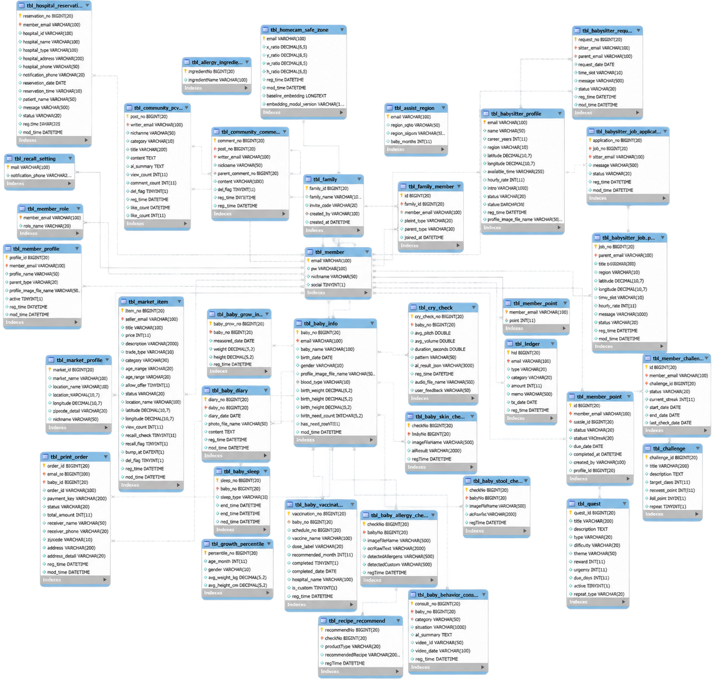
</div>

---

### 🔗 유스케이스 다이어그램

<div align="center">

</div>

---

### 📅 WBS

<div align="center">
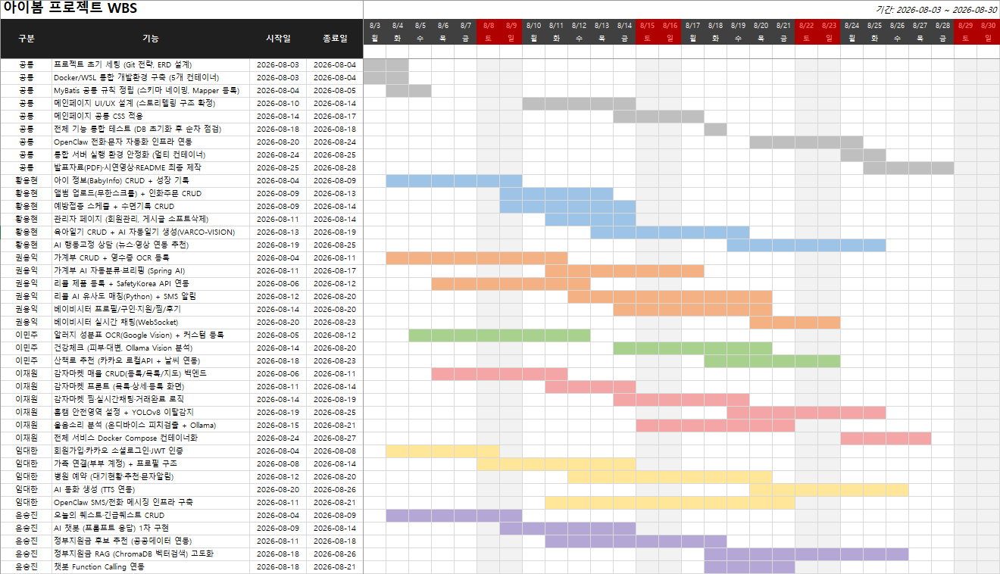
</div>

<div align="right"><a href="#-목차"><sub>▲ 목차로</sub></a></div>


<!-- ============================================================= -->
<!-- 3구역 : 성능 최적화                                            -->
<!-- ============================================================= -->

## ⚡ 성능 최적화

### ① 베이비시터 채팅 안읽음 배지 &nbsp;—&nbsp; 단일 쿼리 설계

<kbd>상관 서브쿼리</kbd> <kbd>폴링 최소화</kbd> &nbsp;·&nbsp; 적용 화면: 베이비시터 채팅

<table>
<tr><th align="center" width="50%">🔴 Before</th><th align="center" width="50%">🟢 After</th></tr>
<tr>
<td>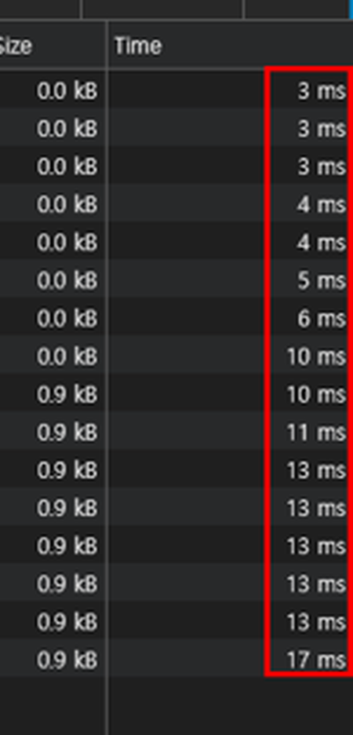</td>
<td>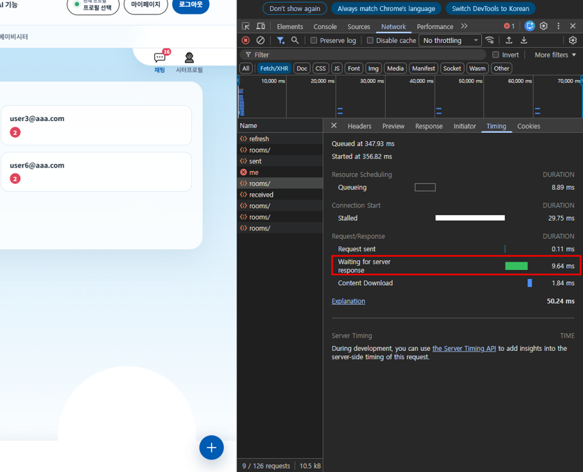</td>
</tr>
</table>

- 채팅방 목록 조회(`selectListByMember`) 안에 상관 서브쿼리로 방마다의 안읽은 메시지 수를 함께 계산 — 방 개수와 무관하게 API 호출 1회 유지
- `BabysitterLayoutPage`에서 20초 주기로 `getMyRoomList()`만 호출하고, 응답의 `unreadCount`를 합산해 배지로 표시
- N+1을 나중에 제거한 게 아니라, 배지 기능을 추가하던 시점부터 O(1) 단일 쿼리로 설계

| 지표                      | 방마다 개별 조회 방식         | 단일 쿼리 설계 (현재)             | 기대 효과      |
| ------------------------- | ----------------------------- | --------------------------------- | -------------- |
| API 호출 수 (방 8개 기준) | 9회 (목록 1 + 방별 8)         | 1회                               | 호출 수 약 1/9 |
| 조회 구조                 | 목록 조회 후 방별로 추가 조회 | 목록 + 안읽음 수를 한 쿼리로 계산 | DB 왕복 상수화 |
| 폴링 부하                 | 방 개수(N)에 비례             | 방 개수 무관, 상수                | 확장성 확보    |

---

### ② 리액트 렌더링 최적화

<kbd>React.lazy</kbd> <kbd>Suspense</kbd> <kbd>IntersectionObserver</kbd> <kbd>useCallback</kbd> &nbsp;·&nbsp; 적용 범위: 13/14 라우터

**① 무한 스크롤 — 옵저버 재생성 방지 (`useCallback`)**

<table>
<tr><th align="center" width="50%">🔴 Before</th><th align="center" width="50%">🟢 After</th></tr>
<tr>
<td align="center">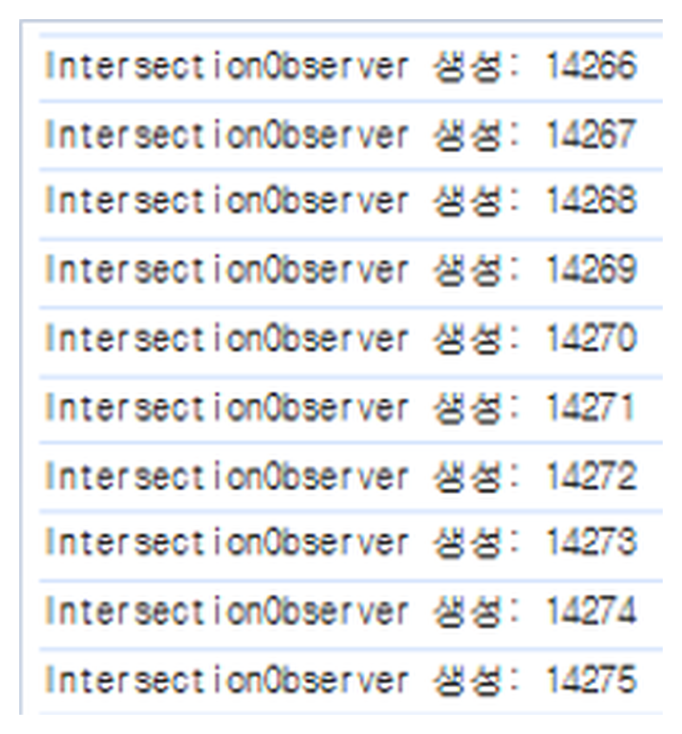</td>
<td align="center">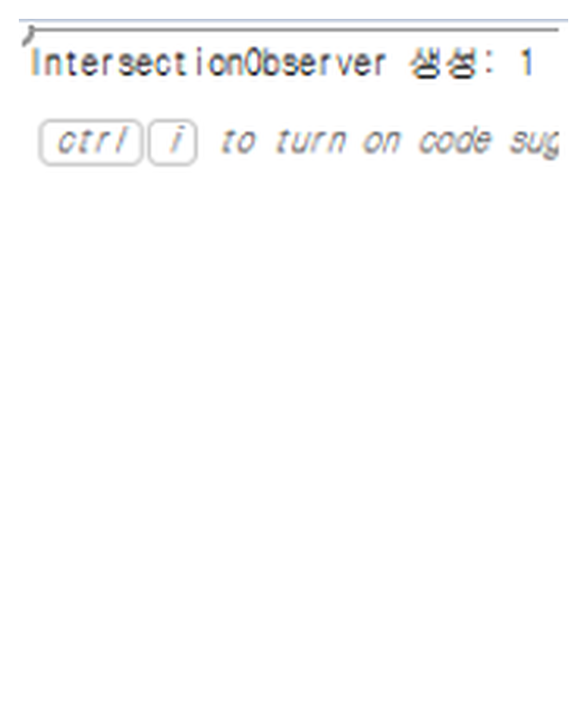</td>
</tr>
</table>

**② 코드 스플리팅 — 라우트·벤더 청크 분리 (`React.lazy`)**

<table>
<tr><th align="center" width="50%">🔴 Before</th><th align="center" width="50%">🟢 After</th></tr>
<tr>
<td align="center">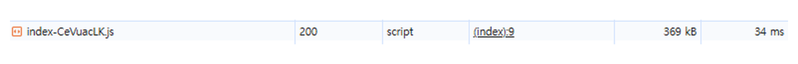</td>
<td align="center">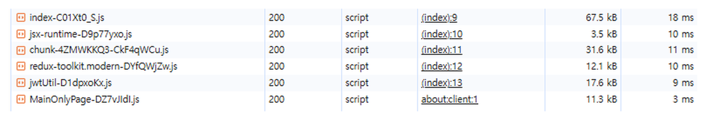</td>
</tr>
</table>

- **코드 스플리팅** — 각 페이지를 `React.lazy`로 감싸 실제로 진입할 때만 코드를 로드(`Suspense` fallback). 첫 진입 시 현재 페이지 코드만 받으면 되어 초기 번들 크기 감소, 첫 화면 렌더 속도 개선
- **무한 스크롤** — `IntersectionObserver`로 스크롤 하단을 감지해 다음 사진들을 자동으로 이어붙임
- **`useCallback`** — 스크롤 감지 콜백을 고정해, 리렌더마다 옵저버가 재생성되어 감지가 끊기거나 오작동하는 문제를 방지

**코드 — React.lazy + IntersectionObserver**

```tsx
// recallRouter.tsx (13/14개 라우터에 동일 패턴)
const List = lazy(() => import("../pages/recall/RecallListPage"));
<Suspense fallback={Loading}>...</Suspense>;
```

```tsx
// AlbumGridComponent.tsx:44-54
const sentinelRef = useCallback((node: HTMLDivElement | null) => {
  if (observerRef.current) observerRef.current.disconnect();
  observerRef.current = new IntersectionObserver((entries) => {
    if (entries[0].isIntersecting) {
      setPage((prev) => prev + 1);
    }
  });
  if (node) observerRef.current.observe(node);
}, []);
```

---

### ③ AI 산책 추천 &nbsp;—&nbsp; 좌표 기반 캐싱

<kbd>@Cacheable</kbd> <kbd>Caffeine</kbd> &nbsp;·&nbsp; 적용 화면: 산책 코스 추천

- `KakaoLocalClient.searchNearbyParks()`에 `@Cacheable` 적용 — 동일 조건 재요청 시 Kakao API를 다시 호출하지 않음
- 캐시 키: 위·경도를 소수점 3자리로 반올림(약 90~111m 격자) — 같은 동네 사용자끼리 캐시 공유
- Caffeine `expireAfterWrite(30분)` · `maximumSize(1000)` — 알러지 성분 캐싱과 전역 `CacheManager` 공유

| 지표           | 캐싱 미적용 시          | 현재 구현                         | 기대 효과           |
| -------------- | ----------------------- | --------------------------------- | ------------------- |
| Kakao API 호출 | 추천 요청마다 매번 1회  | 동일 격자·30분 이내 재요청 시 0회 | 일일 호출 쿼터 절감 |
| 캐시 공유 범위 | 요청자 개별 (공유 없음) | 약 100m 격자 내 사용자끼리 공유   | 캐시 적중률 향상    |
| 캐시 관리      | 없음                    | Caffeine, TTL 30분, 최대 1000건   | 메모리 상한 확보    |

**코드 — @Cacheable 키 설계 · Caffeine 설정**

```java
// KakaoLocalClient.java
@Cacheable(value = "nearbyParks",
    key = "Math.round(#lat*1000)+'_'+Math.round(#lng*1000)+'_'+#radiusM")
public List<KakaoPlace> searchNearbyParks(double lat, double lng, int radiusM)
```

```java
// CacheConfig.java  (알러지 성분 캐싱과 공유하는 전역 CacheManager)
cacheManager.setCaffeine(
  Caffeine.newBuilder()
    .expireAfterWrite(30, TimeUnit.MINUTES)
    .maximumSize(1000));
```

---

### ④ 반응형 웹 &nbsp;—&nbsp; 디바이스별 레이아웃 대응

<kbd>CSS Flexbox/Grid</kbd> <kbd>Media Query</kbd>

- PC·태블릿·모바일 등 다양한 디바이스 환경에 맞춰 레이아웃이 자동으로 변경되도록 구현해 어떤 화면에서도 최적의 UI 제공
- 화면 크기에 따라 컴포넌트의 크기·배치·여백을 유동적으로 조정해 가독성과 사용성을 높이고 직관적인 사용자 경험 제공
- 다양한 해상도·브라우저 환경에서도 일관된 UI/UX를 유지하도록 반응형 웹을 적용해 접근성과 호환성 향상

<table>
<tr><th align="center">💻 Web</th><th align="center">📱 App</th></tr>
<tr>
<td>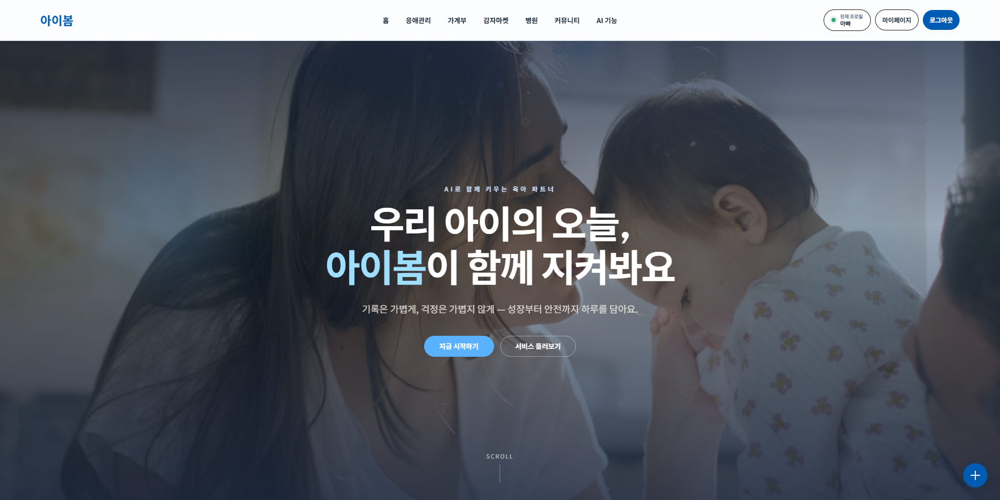</td>
<td>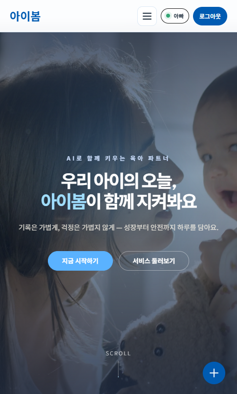</td>
</tr>
</table>

<div align="right"><a href="#-목차"><sub>▲ 목차로</sub></a></div>


<!-- ============================================================= -->
<!-- 4구역 : 트러블슈팅                                             -->
<!-- ============================================================= -->

## 🧯 트러블슈팅

### ① 지자체 지원금 색인 &nbsp;—&nbsp; 다른 정책의 대상 정보가 섞여 저장됨

<table>
<tr><td width="86" align="center">🔴<br/><b>문제</b></td><td>지자체 지원금을 색인할 때 그 정책이 아닌 <b>다른 정책의 대상 정보</b>가 저장되어, 실제 지원 대상과 RAG 답변의 대상 조건이 불일치. 여러 지자체 정책에 같은 대상 조건이 붙어 벡터 검색 결과가 왜곡됨</td></tr>
<tr><td align="center">🔍<br/><b>원인</b></td><td><code>target</code> 변수를 중앙부처 지원금 반복문 안에서만 선언 → 지자체 반복문은 현재 <code>item</code>의 대상 정보를 다시 읽지 않고 <b>마지막 중앙부처 지원금의 <code>target</code>을 재사용</b>. 중앙부처·지자체 색인 로직이 중복돼 필드 초기화가 누락됨</td></tr>
<tr><td align="center">🟢<br/><b>해결</b></td><td>정책 1건을 변환하는 <code>_policy_record()</code> 공통 함수로 통합 — 함수 안에서 매 <code>item</code>마다 대상·생애주기·지역을 새로 추출하고 중앙부처·지자체를 동일 로직으로 처리. 지자체 정책이 자기 대상 정보를 쓰는지 검증하는 테스트 추가</td></tr>
</table>

- 각 지자체 지원금에 해당 정책 고유의 대상 정보가 정상 저장 → 잘못된 값이 임베딩·Metadata에 섞이는 **데이터 오염 방지**
- 중복 색인 로직을 공통 함수로 합쳐 유지보수성 향상, 대상·생애주기·지역에 대한 자동 테스트로 동일 문제 재발 방지

**코드 — `_policy_record()`에서 item별 대상 정보 재추출**

```python
# 지원금 색인 — 정책 1건을 문서·메타데이터로 변환 (중앙부처·지자체 공통)
target = str(
    item.get("trgterIndvdlArray") or item.get("sprtTrgtCn") or ""
).strip()
life_stage = str(
    item.get("lifeArray") or item.get("lifeNmArray") or ""
).strip()
sido = str(item.get("ctpvNm") or "").strip() if local else ""
sigungu = str(item.get("sggNm") or "").strip() if local else ""

document_parts = [f"정책명: {title}"]
if target:     document_parts.append(f"대상: {target}")
if life_stage: document_parts.append(f"생애주기: {life_stage}")
region = " ".join(filter(None, (sido, sigungu)))
if region:     document_parts.append(f"지역: {region}")

metadata = {
    **_stage_flags(life_stage),
    "target": target, "life_stage": life_stage,
    "sido": sido, "sigungu": sigungu,
}
```

---

### ② 문자 발송 중복 방지 &nbsp;(OpenClaw 연동)

<table>
<tr><td width="86" align="center">🔴<br/><b>문제</b></td><td>LLM 에이전트가 도구를 반복 호출하거나 네트워크 재시도가 나면 <b>같은 문자가 여러 번 발송</b>될 수 있음. 응답 실패로 판단해도 Android에서는 이미 발송된 뒤라 단순 재시도가 곧 중복 발송</td></tr>
<tr><td align="center">🔍<br/><b>원인</b></td><td>프롬프트로 "한 번만 호출"을 지시해도 도구 호출 횟수를 보장 못 함. 동일 요청과 새 요청을 구분할 공통 식별자가 없고, Spring·OpenClaw·네트워크 각 구간에서 재시도가 발생</td></tr>
<tr><td align="center">🟢<br/><b>해결</b></td><td>요청마다 <code>msg_ + UUID</code> 형식의 <code>missionId</code> 발급. 일반 대화와 문자 발송을 분리해 <code>message-dispatcher</code> 전용 워크스페이스로 격리(<code>android_sms_send</code>만 허용). 처리된 <code>missionId</code>·결과를 캐시해 같은 ID엔 기존 결과 반환, 요청/반환 ID 불일치 시 즉시 실패, JSON 외 응답은 거부</td></tr>
</table>

<table>
<tr><th align="center" width="50%">🚨 SOS 응급실 요청</th><th align="center" width="50%">📅 병원 예약 접수</th></tr>
<tr>
<td align="center">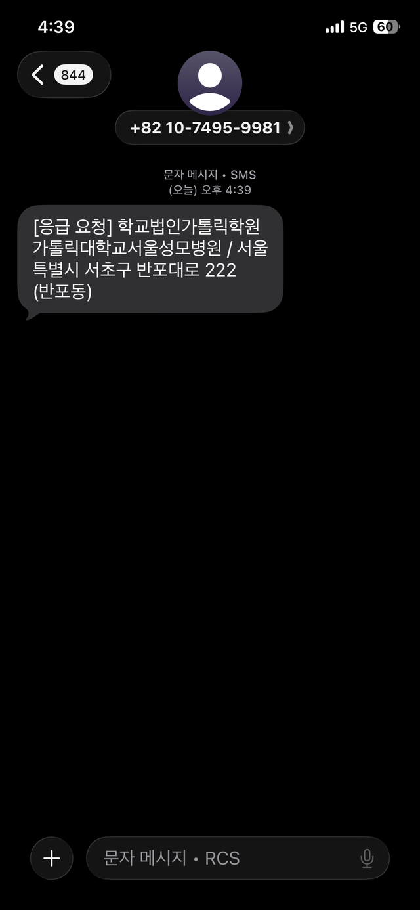</td>
<td align="center">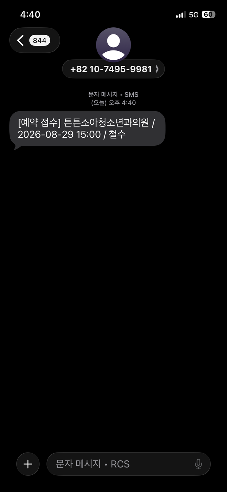</td>
</tr>
</table>

- `missionId` 하나로 Spring → OpenClaw → 플러그인 → Android 전 구간 추적
- 같은 실행에서 도구가 다시 호출되면 즉시 종료, `missionId` 변경·다른 미션 결과 반환 시 Spring이 차단

**코드 — 요청/반환 `missionId` 검증**

```java
// MessageMissionDispatchServiceImpl.java
if (!missionId.equals(resultMissionId)) {
  throw new OpenClawGatewayException("OPENCLAW_MISSION_ID_MISMATCH");
}
```

---

### ③ AI 육아일기 이미지 리사이징

<table>
<tr><td width="86" align="center">🔴<br/><b>문제</b></td><td>사진에 따라 AI 일기 생성이 되기도 안 되기도 하고, 응답 속도 편차가 큼</td></tr>
<tr><td align="center">🔍<br/><b>원인</b></td><td>백엔드가 원본 이미지를 base64로 그대로 Python에 전달 → 카메라 사진에서 타임아웃, 메모리 100% 근접</td></tr>
<tr><td align="center">🟢<br/><b>해결</b></td><td>Python에서 <code>image.thumbnail((1536, 1536), Image.LANCZOS)</code>로 축소 후 VARCO-VISION에 전달 (1536px 이하 원본은 그대로)</td></tr>
</table>

<table>
<tr><th align="center" width="50%">🔴 Before</th><th align="center" width="50%">🟢 After</th></tr>
<tr>
<td>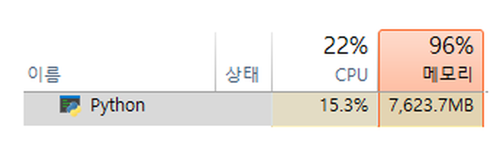</td>
<td>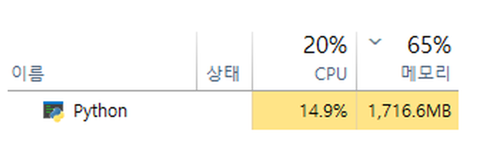</td>
</tr>
</table>

- 고화질 사진에서도 타임아웃·메모리 부족 없이 정상 작동
- 이미지 크기가 줄어든 만큼 결과 처리 속도 개선, 화질 손실이 가장 적은 LANCZOS 필터 사용

**코드 — Python 리사이징 · 백엔드 원본 전송**

```python
# diary_vision_service.py — Python에서 이미지 리사이징
image.thumbnail((MAX_IMAGE_DIMENSION, MAX_IMAGE_DIMENSION), Image.LANCZOS)
```

```java
// DiaryVisionClient.java — 백엔드는 원본을 base64로 그대로 전송
String base64Image = Base64.getEncoder().encodeToString(imageBytes);
JsonObject body = new JsonObject();
body.addProperty("imageBase64", base64Image);
HttpRequest request = HttpRequest.newBuilder()
    .uri(URI.create(baseUrl + "/api/v1/diary/generate"))
    .POST(HttpRequest.BodyPublishers.ofString(body.toString()))
    .build();
```

<div align="right"><a href="#-목차"><sub>▲ 목차로</sub></a></div>


<!-- ============================================================= -->
<!-- 주요 기능                                                     -->
<!-- ============================================================= -->

## ✨ 주요 기능

<div align="center">
<table>
<tr>
<td align="center">👶<br/><b>아이 등록·대시보드</b></td>
<td align="center">📔<br/><b>육아일기·앨범</b></td>
<td align="center">😴<br/><b>수면 조언</b></td>
<td align="center">🧭<br/><b>AI 행동교정</b></td>
<td align="center">💰<br/><b>AI 가계부</b></td>
</tr>
<tr>
<td align="center">🔔<br/><b>리콜 알림</b></td>
<td align="center">💬<br/><b>커뮤니티</b></td>
<td align="center">🤝<br/><b>베이비시터</b></td>
<td align="center">🧾<br/><b>알레르기</b></td>
<td align="center">🩺<br/><b>건강 체크</b></td>
</tr>
<tr>
<td align="center">🚶<br/><b>산책로 추천</b></td>
<td align="center">🥔<br/><b>감자마켓</b></td>
<td align="center">📹<br/><b>홈캠 감지</b></td>
<td align="center">🔊<br/><b>울음소리</b></td>
<td align="center">🔐<br/><b>로그인·가족</b></td>
</tr>
<tr>
<td align="center">🚑<br/><b>병원·SOS</b></td>
<td align="center">📖<br/><b>맞춤 동화</b></td>
<td align="center">📋<br/><b>일일 퀘스트</b></td>
<td align="center">🏛️<br/><b>정부지원금</b></td>
<td align="center">🤖<br/><b>AI 상담</b></td>
</tr>
</table>
<sub>플로우 이미지 1장 + 동작 GIF · <b>팀원별</b>로 아래에 정리</sub>
</div>

> AI가 제공하는 사진 분석·성분 매칭·지원금 안내 등은 모두 **참고용 정보**입니다. 의료·법률적 진단이나 판정을 대체하지 않으며, 이상이 의심되면 전문가·해당 기관에 확인하도록 안내합니다.


### 🧑‍✈️ 황용현 · 팀장

#### 1. 👶 아이 등록 & 대시보드 &nbsp;<kbd>Recharts</kbd> <kbd>Python AI</kbd>

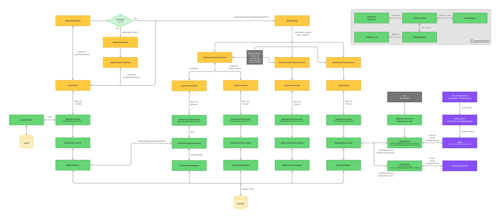

- 아이 정보 등록부터 성장·예방접종·수면 기록까지 한 곳에서 CRUD
- 아이 정보는 최상단 Page에서 props로 내려주고, 없으면 아이 등록 페이지로 이동
- 성장·접종·수면 기록을 Recharts로 시각화해 한눈에 확인

<table>
<tr>
<td align="center" width="50%"><br/><sub><b>아이 등록</b></sub></td>
<td align="center" width="50%"><br/><sub><b>우리 아이</b></sub></td>
</tr>
</table>

---

#### 2. 📔 육아일기 & 앨범 &nbsp;<kbd>VARCO-VISION</kbd> <kbd>무한 스크롤</kbd> <kbd>exifr</kbd> <kbd>Toss Payments</kbd>

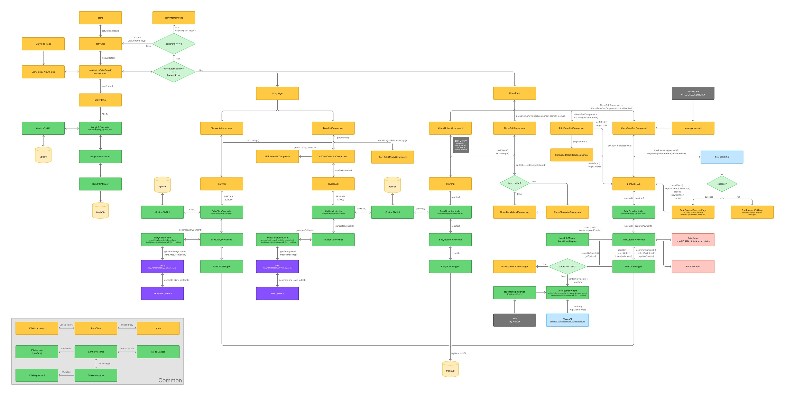

- 사진을 넣으면 AI가 육아일기 초안을 생성, 폴라로이드 프레임 + TTS + 애니메이션으로 영상 변환
- `MultipartFile → byte[] → Base64`로 변환해 Python 서버에 전달
- 앨범은 드래그 앤 드롭 + exifr로 촬영일자·위치 추출, 인화 주문은 Toss Payments로 결제 (`PENDING → PAID` 상태 관리로 중복 결제 방지)

<table>
<tr>
<td align="center" width="50%"><br/><sub><b>육아일기</b></sub></td>
<td align="center" width="50%"><br/><sub><b>앨범</b></sub></td>
</tr>
</table>

---

#### 3. 😴 AI 수면 조언 &nbsp;<kbd>scikit-learn</kbd> <kbd>Ollama qwen3</kbd>

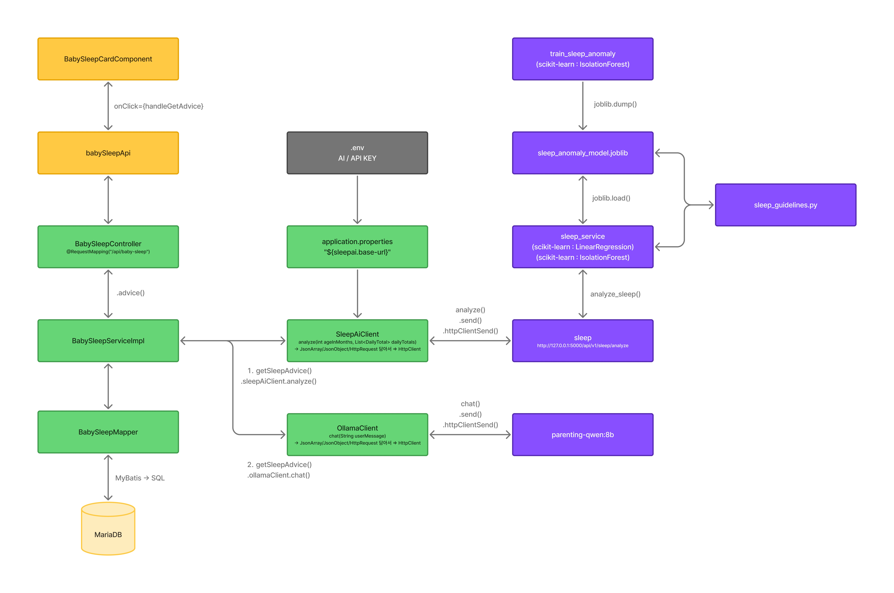

- 아이 개월 수를 계산하고 최근 7일 수면 기록을 `TreeMap` + `HashSet`으로 집계해 Python 분석 서버에 전달
- `LinearRegression`으로 7일간 하루 총 수면시간의 증감 기울기를 계산, `IsolationForest`로 그날 수면시간이 이상치인지 판단(전체의 5%를 이상치로 설정, 정상=1 / 이상=-1)
- 추세·이상치 결과를 텍스트로 조립해 `Ollama qwen3`가 최종 수면 조언을 생성

<p align="center"><br/><sub><b>AI 수면 조언</b></sub></p>

---

#### 4. 🧭 AI 행동교정 &nbsp;<kbd>Ollama qwen3</kbd> <kbd>Naver News</kbd> <kbd>YouTube Data</kbd>

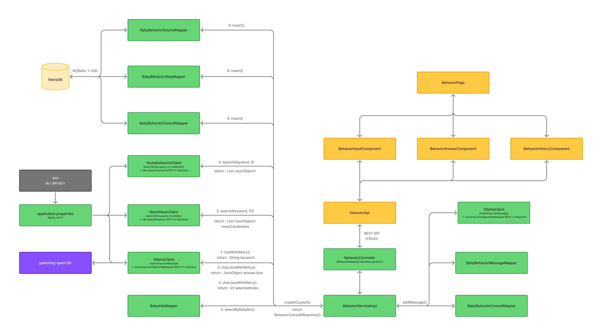

- 상담 내용을 AI가 분석해 검색 키워드 생성 → 네이버 뉴스 10건·유튜브 영상 5건 조회
- AI가 기사를 필터링해 해결책 3개 + 영상 1개 선정, 상담·단계·출처를 DB에 저장하고 3단계로 반환

<p align="center"><br/><sub><b>AI 행동교정</b></sub></p>


### 🔑 임대한 · 팀원

#### 1. 🔐 Kakao 로그인 & 가족 관리 &nbsp;<kbd>Kakao OAuth</kbd> <kbd>다중 프로필</kbd>


- 카카오 인증만으로는 로그인시키지 않고 가입 완료 시점에만 JWT 발급
- 가족 초대 + 다중 프로필로 한 계정 안에서 보호자별 프로필 분리

<p align="center"><br/><sub><b>Kakao 로그인 · 가족 관리</b></sub></p>

---

#### 2. 🚑 병원 & SOS &nbsp;<kbd>공공데이터포털 응급의료 API</kbd> <kbd>SMS</kbd>

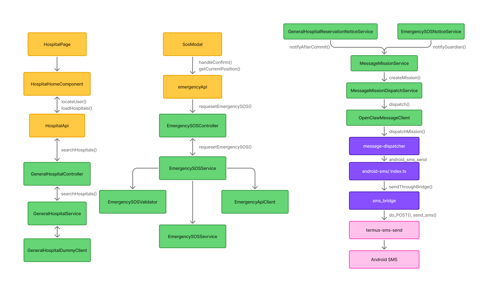

- 지도에서 병원 검색, 예약·대기 현황 확인
- SOS는 공공 API로 응급실 병상을 조회하고 문자로 도움 요청 전송
- 문자는 `Source`(타입 — 병원예약·SOS·리콜 등) · `To`(보호자 번호) · `Context`(내용) 구조로 통일해 다른 파트에서도 재사용

<table>
<tr>
<td align="center" width="50%"><br/><sub><b>병원</b></sub></td>
<td align="center" width="50%"><br/><sub><b>SOS</b></sub></td>
</tr>
</table>

---

#### 3. 📖 맞춤 동화 생성 &nbsp;<kbd>parenting-qwen:8b</kbd> <kbd>Supertonic / Piper TTS</kbd>

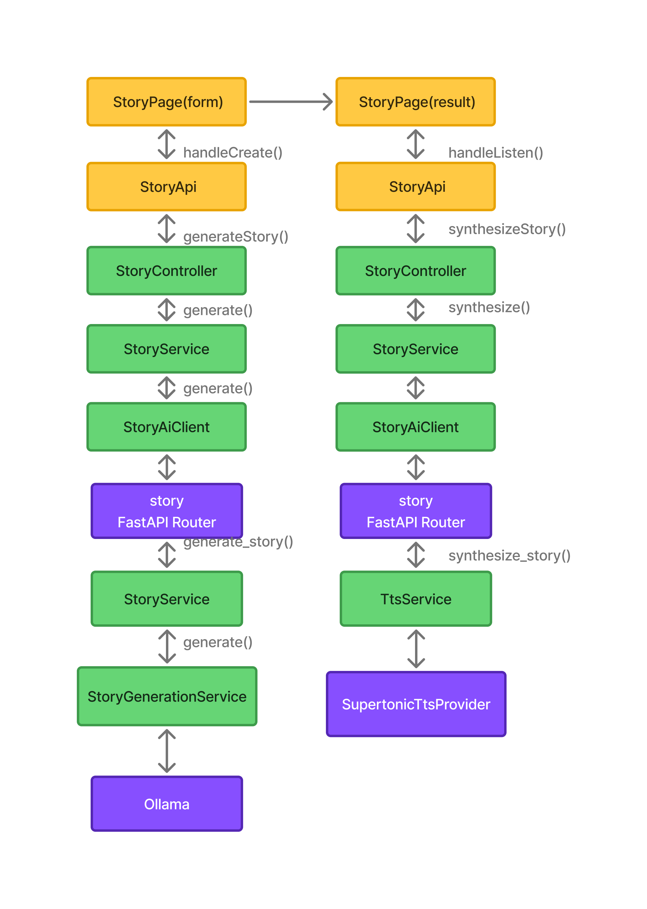

- 아이 이름·개월 수·관심사·좋아하는 사물을 반영하고 취침·모험·우정·습관·가족 테마를 제공, 입력 정보에 따라 등장인물과 동화 구조를 자동 구성
- 전체 동화를 4개 파트로 나누어 순차 생성 — 이전 파트의 등장인물·줄거리를 다음 파트에 전달, 파트별 430~650자 + JSON 형식 검증, 검증 실패 시 조건을 보강해 자동 재생성
- 완성된 본문을 음성으로 변환해 WAV 재생·다운로드 제공, 기본 TTS 실패 시 보조 Provider로 자동 전환하고 Provider·Voice 정보를 함께 반환

<p align="center"><br/><sub><b>맞춤 동화 생성</b></sub></p>

---

#### 4. 🏛️ 정부지원금 어시스턴트 &nbsp;<kbd>RAG</kbd> <kbd>ChromaDB</kbd> <kbd>공공데이터포털</kbd> <kbd>공동</kbd>

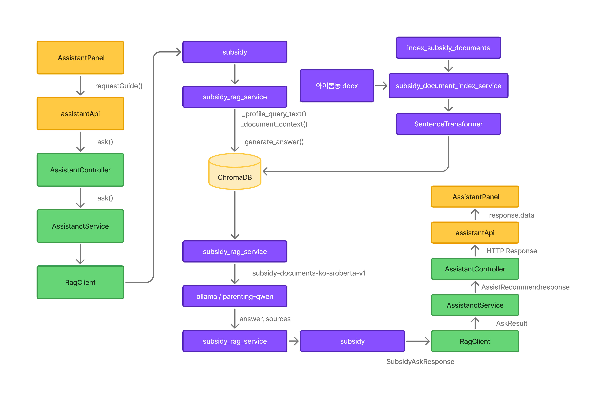

- 아이 개월 수를 생애주기로 변환하고 거주지·가구원 수·소득 구간·가구 특성 + 질문을 결합해 **맞춤 검색어를 생성**
- 지역·연령 Metadata Filtering으로 ChromaDB 검색 조건을 구성하고, RAG 구조로 근거를 보강한 뒤 Ollama가 **공식 출처와 함께 답변 생성**
- <b>임대한</b> RAG 파이프라인·ChromaDB 색인 구축 · <b>윤승진</b> 정부지원금 공공 API 연동

<p align="center"><br/><sub><b>정부지원금 어시스턴트</b></sub></p>


### 🛒 이재원 · 팀원

#### 1. 🥔 감자마켓 (중고거래) &nbsp;<kbd>WebSocket</kbd> <kbd>거래 검증 체인</kbd>

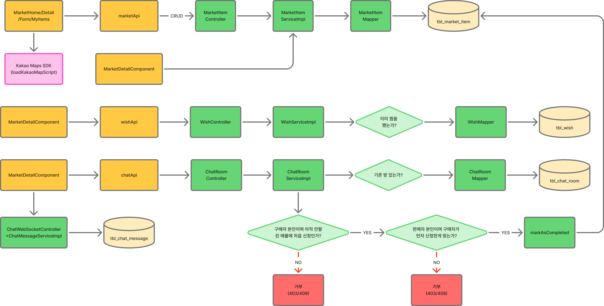

- 거래완료는 "구매자 신청 → 판매자 확정" 순서를 코드 단에서 강제 — 단독/중복 완료를 검증 체인으로 차단

<p align="center">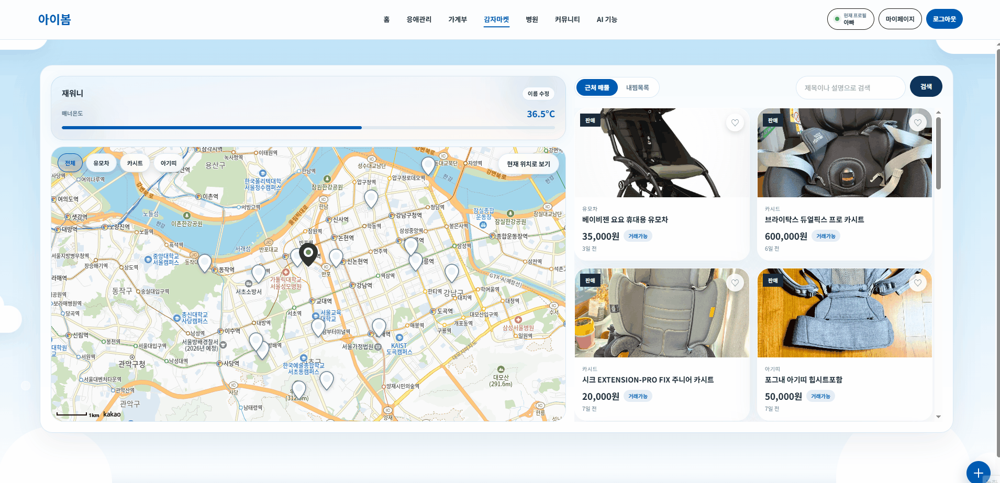<br/><sub><b>감자마켓</b></sub></p>

---

#### 2. 📹 홈캠 안전구역 이탈 감지 &nbsp;<kbd>YOLOv8n</kbd> <kbd>OpenCV</kbd>

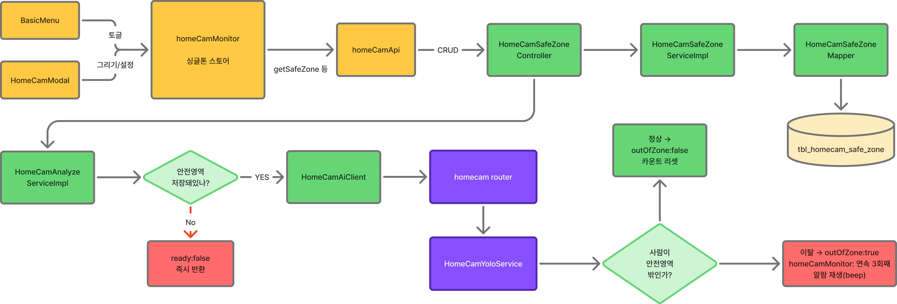

- COCO 클래스 중 '사람'만 걸러내고 신뢰도 0.4 미만 제거 → 저신뢰도 오탐 차단
- 사람 박스 전체가 아닌 중심점으로 안전영역 판정 → 몸통이 실제로 벗어난 경우만 감지

<p align="center"><br/><sub><b>홈캠 이탈 감지</b></sub></p>

---

#### 3. 🔊 AI 울음소리 분석 &nbsp;<kbd>신호 필터링</kbd> <kbd>Ollama</kbd>

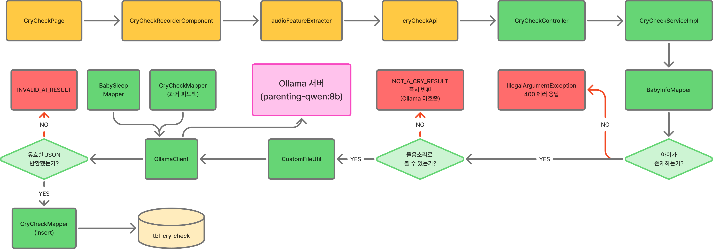

- 피치가 200~1000Hz를 벗어나면 바로 반환해 불필요한 Ollama 호출 차단
- LLM 응답에서 JSON을 못 찾으면 안전한 대체 응답으로 조용히 넘어가 파싱 에러 방지

<p align="center">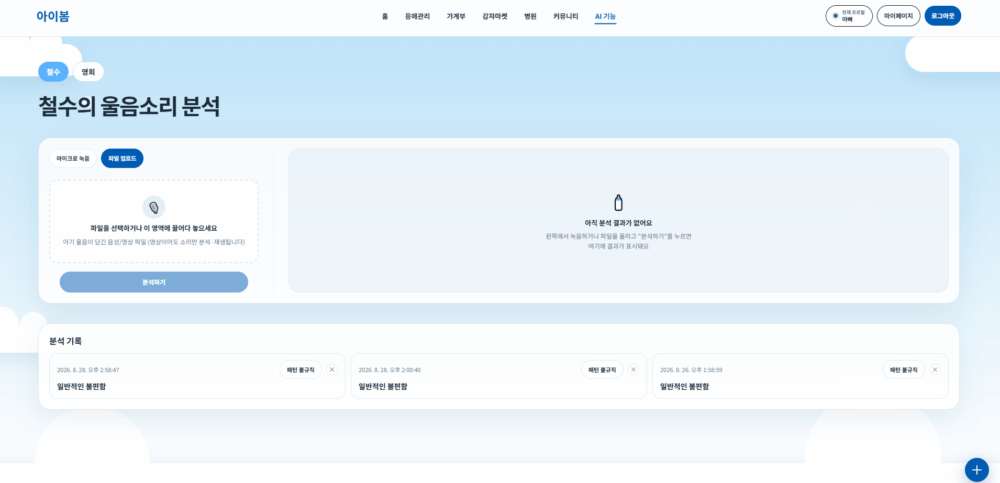<br/><sub><b>AI 울음소리 분석</b></sub></p>


### 💼 권용익 · 팀원

#### 1. 💰 AI 가계부 &nbsp;<kbd>Spring AI</kbd> <kbd>Google Vision OCR</kbd>

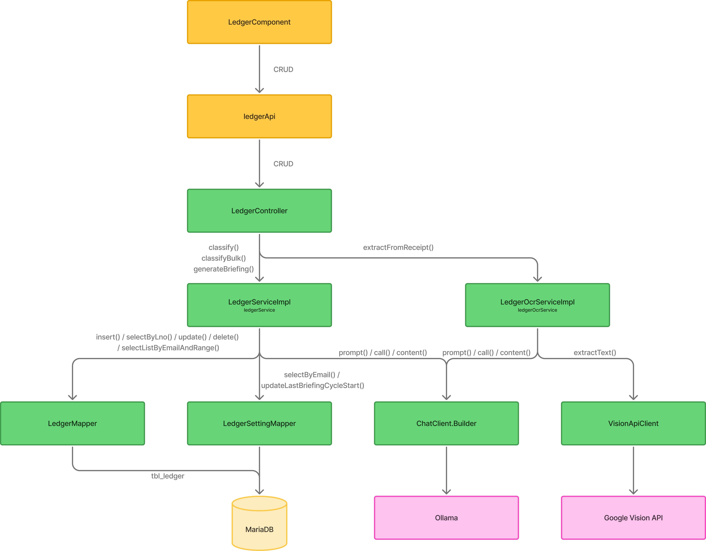

- "스타벅스 아메리카노 4500원"처럼 자연어로 입력하면 Spring AI가 금액·수입/지출·카테고리·항목명을 추출해 자동 분류
- 지출 내역을 모아 AI 브리핑으로 이번 달 소비 요약 제공

<p align="center">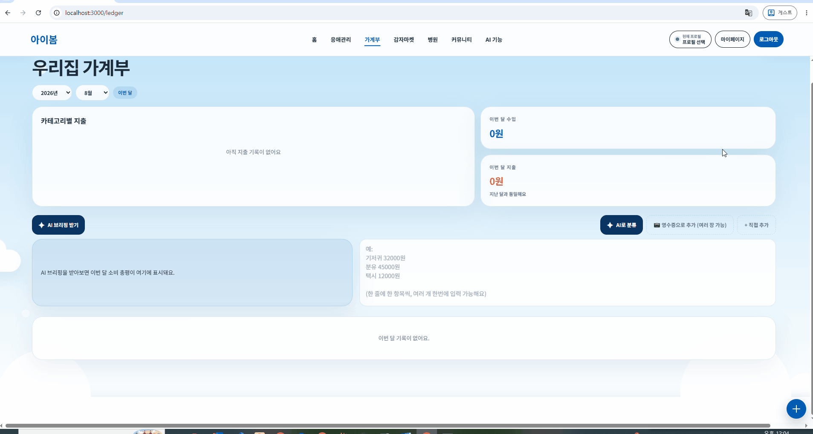<br/><sub><b>AI 가계부</b></sub></p>

---

#### 2. 🔔 AI 육아용품 자동 리콜 알림 &nbsp;<kbd>OCR</kbd> <kbd>sentence-transformers</kbd> <kbd>SafetyKorea API</kbd>

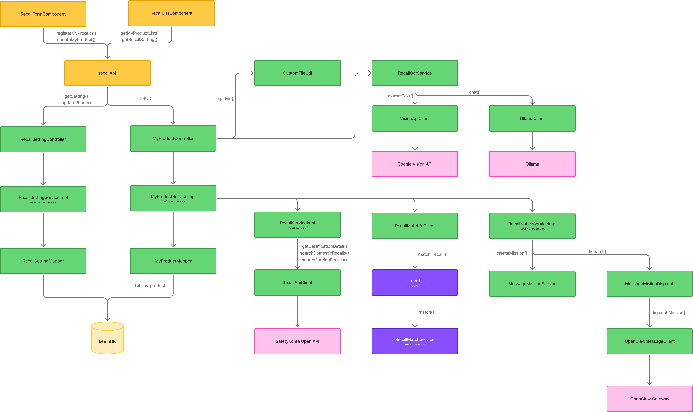

- 제품 라벨 사진 → Google Vision OCR → Ollama가 제품명·브랜드·모델·인증번호를 JSON으로 구조화해 폼 자동 입력
- 등록된 내 제품을 국내·해외·인증 리콜 정보와 임베딩 유사도로 대조, 리콜 대상이 되면 스케줄러가 감지해 SMS 자동 알림

<p align="center">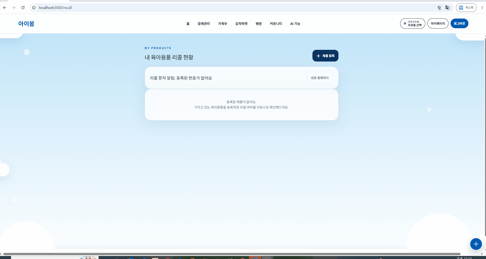<br/><sub><b>AI 리콜 알림</b></sub></p>

---

#### 3. 💬 커뮤니티 & 🤝 베이비시터 &nbsp;<kbd>AI 한줄요약</kbd> <kbd>WebSocket(STOMP)</kbd>


- 게시글마다 1회만 AI 요약을 호출하고 DB에 캐싱, 글 수정 시 캐시 비움
- 베이비시터는 거리 기반 검색 후 요청·수락, WebSocket 실시간 채팅으로 소통

<table>
<tr>
<td align="center" width="50%">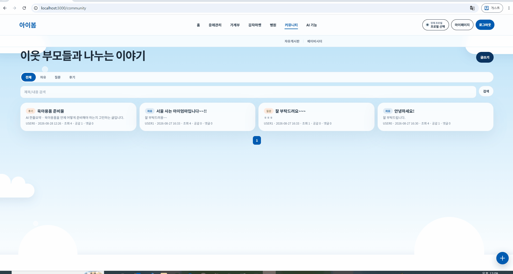<br/><sub><b>커뮤니티</b></sub></td>
<td align="center" width="50%">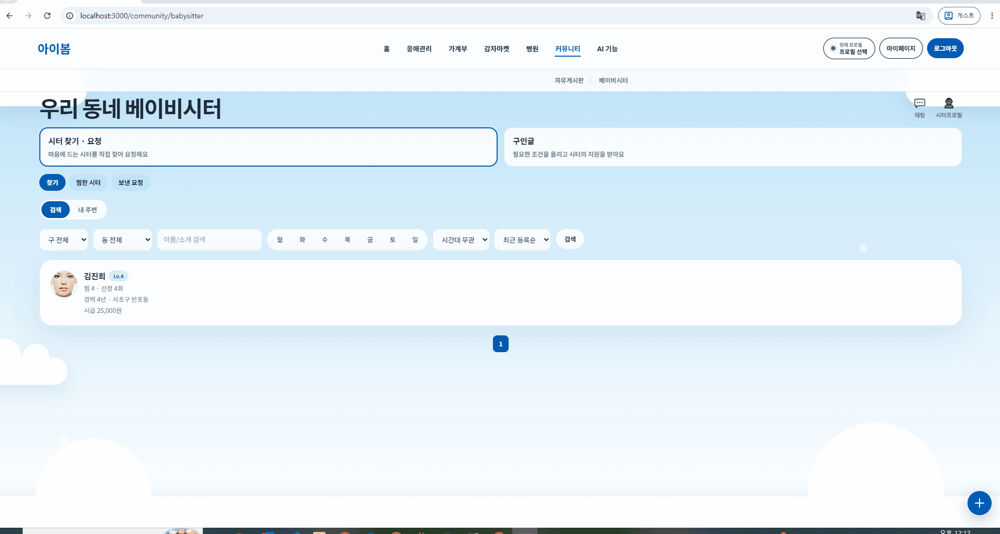<br/><sub><b>베이비시터</b></sub></td>
</tr>
</table>


### 📋 윤승진 · 팀원

#### 1. 📋 일일 퀘스트 &nbsp;<kbd>실시간 푸시</kbd> <kbd>스케줄링</kbd>


- 아이 정보 미등록 시 기본 퀘스트 3개 자동 생성, 등록 후 월령·담당 부모·요일 기반으로 교체
- 같은 계정의 다른 프로필 보호자에게 긴급 퀘스트를 실시간 푸시

<table>
<tr>
<td align="center" width="50%"><br/><sub><b>일일 퀘스트</b></sub></td>
<td align="center" width="50%"><br/><sub><b>긴급 퀘스트</b></sub></td>
</tr>
</table>

---

#### 2. 💬 육아 AI 상담 챗봇 &nbsp;<kbd>Ollama</kbd> <kbd>parenting-qwen</kbd>

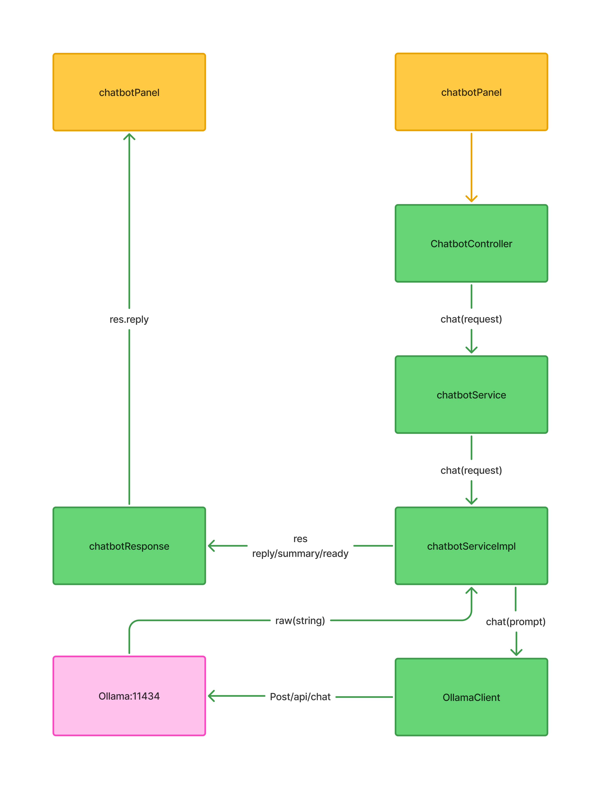

- 수면·수유·이유식·발달·훈육 등 육아 전반을 대화형으로 상담 — 진단·처방은 하지 않고, 위험 증상이면 병원·응급실 안내만
- 이전 대화를 함께 전달해 맥락을 유지하고, LLM 응답에서 JSON만 추출해 파싱 실패 시 원문으로 안전하게 폴백

<p align="center">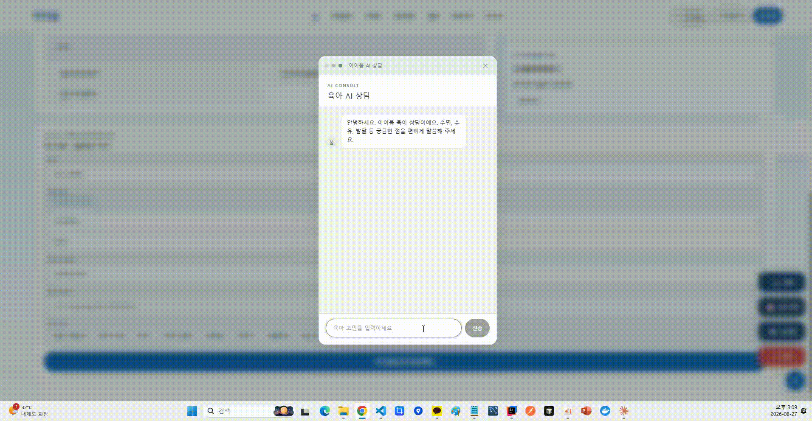<br/><sub><b>육아 AI 상담 챗봇</b></sub></p>


### 🎨 이민주 · 팀원

#### 1. 🧾 알레르기 성분표 검사 &nbsp;<kbd>Google Vision OCR</kbd>

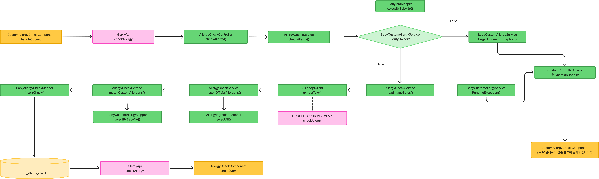

- 성분표 이미지를 OCR로 읽어 등록된 알레르기 성분(공식 + 사용자 커스텀)과 **문자열로 대조** — AI가 판정하는 게 아니라 문자 비교로 일치 항목을 참고용으로 표시

<p align="center">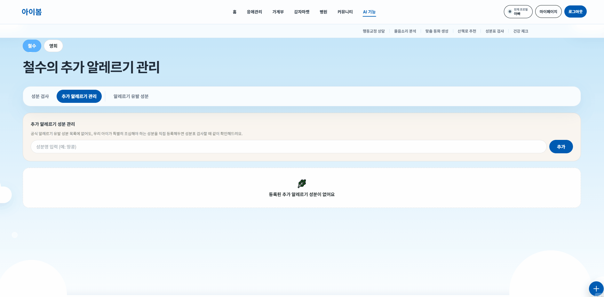<br/><sub><b>알레르기 성분표 검사</b></sub></p>

---

#### 2. 🩺 건강관리 (피부 / 대변 체크) &nbsp;<kbd>Ollama Vision</kbd>

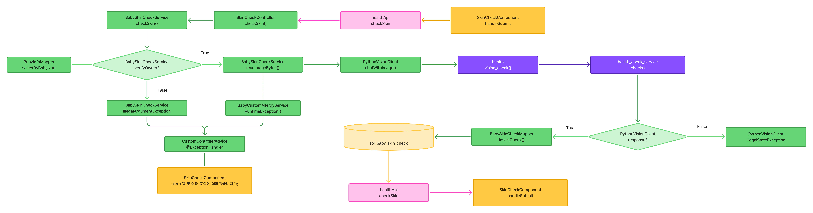

- 피부·대변 사진을 업로드하면 비전 모델(`qwen2.5vl:7b` / `llava`)이 눈에 띄는 특징을 **참고용으로** 이해하기 쉬운 문장으로 정리 (진단 아님, 원본 사진은 저장하지 않음)

<p align="center">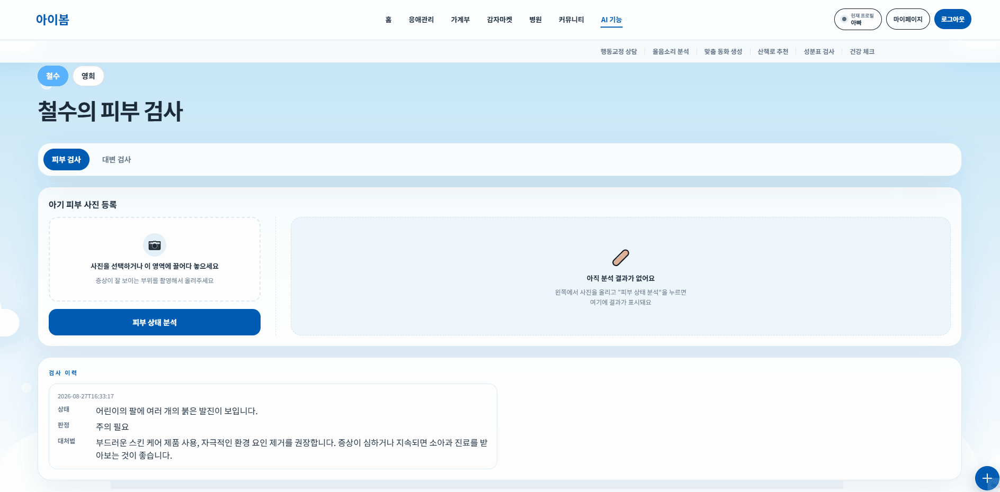<br/><sub><b>건강관리 (피부 / 대변)</b></sub></p>

---

#### 3. 🚶 산책로 추천 &nbsp;<kbd>Kakao Local API</kbd> <kbd>기상청 API</kbd>


- 날씨·위치 기반으로 산책 코스를 추천 (좌표 격자 캐싱으로 Kakao API 호출 절감)
- 주변에 조건에 맞는 공원이 없으면 **조기 반환**으로 날씨·AI 호출을 건너뜀
- 날씨 조회나 AI 코멘트가 실패해도 대체 문구로 이어가 공원 목록은 항상 제공

<p align="center">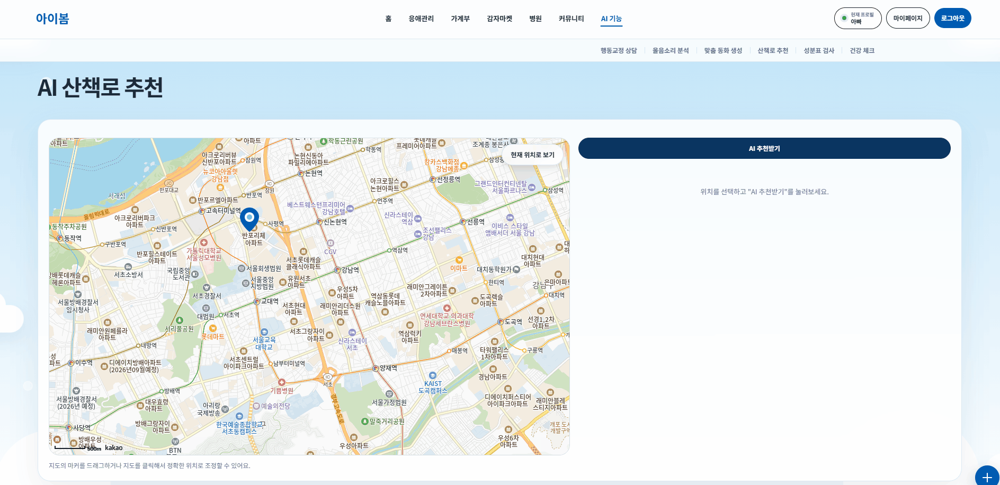<br/><sub><b>산책로 추천</b></sub></p>

<div align="right"><a href="#-목차"><sub>▲ 목차로</sub></a></div>


<!-- ============================================================= -->
<!-- 배포                                                          -->
<!-- ============================================================= -->

## ☁️ AWS 배포

<kbd>AWS EC2</kbd> <kbd>Elastic Beanstalk</kbd> <kbd>RDS</kbd> <kbd>IAM</kbd>

- **EC2 + Elastic Beanstalk** — 애플리케이션을 배포하고 일관된 서버 환경에서 안정적으로 서비스를 운영
- **RDS 연동** — 애플리케이션과 데이터베이스를 분리해 데이터의 안정적인 저장·관리 환경을 구축
- **IAM** — 사용자 및 권한을 관리해 보안을 강화하고 AWS 리소스 접근 권한을 안전하게 제어
- 로컬/개발 환경은 **Docker Compose** 로 6개 서비스(MariaDB · Backend · Frontend · Python AI · Ollama · OpenClaw)를 한 번에 기동 (모델·자산은 첫 기동 시 자동 준비)

<div align="center">
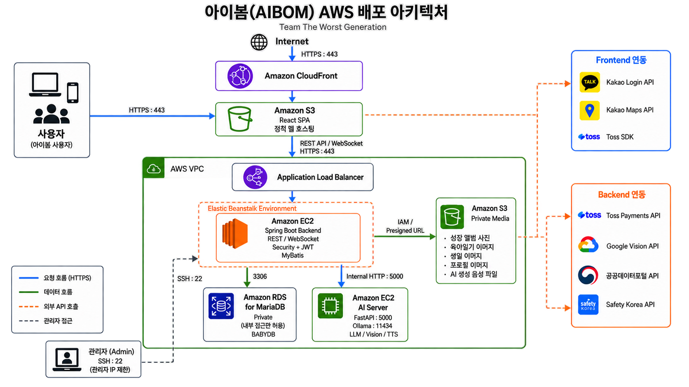
</div>

<div align="right"><a href="#-목차"><sub>▲ 목차로</sub></a></div>


<!-- ============================================================= -->
<!-- 5구역 : 마무리                                                -->
<!-- ============================================================= -->

## 🏁 마무리

<table>
<tr>
<th width="50%">🏆 주요 성과</th>
<th width="50%">💡 배운 점</th>
</tr>
<tr>
<td valign="top">

- **AI 3종 통합** — Ollama · Google Vision OCR · Python AI(sentence-transformers·YOLOv8) · Spring AI RAG(ChromaDB) 를 하나의 플랫폼에서 연결
- **실시간 커뮤니케이션** — WebSocket(STOMP) 기반 베이비시터·감자마켓 실시간 채팅
- **검증된 성능 최적화** — 단일 쿼리 안읽음 배지 · 코드 스플리팅(13/14 라우터) · 좌표 캐싱 · 추론 전 이미지 축소
- **Docker Compose 인프라** — MariaDB·Backend·Frontend·Python AI·Ollama·OpenClaw 6개 서비스 오케스트레이션 (모델·자산 자동 준비)

</td>
<td valign="top">

- **보안·설정은 처음부터** — `JWT_SECRET` 하나가 빠지면 로그인 전체가 막힌다는 걸 겪으며 설정값 관리 습관의 중요성 체감
- **"동작한다" ≠ "안전하다"** — 문자 발송이 여러 번 재시도돼도 같은 결과가 나오도록(멱등성) 처음부터 설계
- **로컬 전용 산출물은 자동화** — 벡터DB 색인처럼 사람이 한 번 실행해야 채워지는 데이터는 문서화만으로는 부족하고 기동 스크립트 차원의 자동 감지·복구가 필요

</td>
</tr>
</table>

<table>
<tr>
<th width="50%">🤔 아쉬운 점</th>
<th width="50%">🚀 향후 계획</th>
</tr>
<tr>
<td valign="top">

- **AI 클라이언트 경로 이원화** — 대부분 기능은 자체 `OllamaClient`(raw HTTP), 가계부만 Spring AI ChatClient를 별도로 써서 구조 일관성이 떨어짐
- **코드 스플리팅 예외** — `hospitalRouter` 한 곳이 `React.lazy` 패턴에서 빠져 완전히 통일되지 않음
- **프론트 메모이제이션 제한적** — `useMemo`·`React.memo`가 비용 큰 연산 위주로 아직 널리 안 쓰임

</td>
<td valign="top">

- **본인인증 확장** — 카카오 외 소셜 로그인, 휴대폰 본인인증(SMS)로 이메일 인증만으로는 못 막는 허위가입까지 방지
- **메모이제이션 정책 정립** — 비용 큰 연산·리스트 렌더링 위주로 `useMemo`·`React.memo` 적용 범위 확대
- **AI 클라이언트 통합** — `OllamaClient` / Spring AI ChatClient 이원 구조를 하나의 추상화로 정리
- **로컬 셋업 자동화 확대** — 벡터DB 자동 색인 패턴을 다른 로컬 전용 산출물에도 동일하게 적용

</td>
</tr>
</table>


<div align="center">
<sub><a href="https://github.com/sai0734/Team_The-Worst-Generation">github.com/sai0734/Team_The-Worst-Generation</a></sub>
</div>
